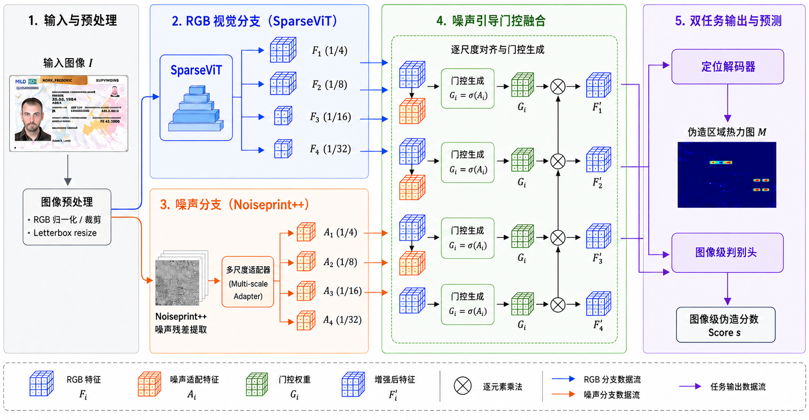

# ForenID-Net

Official code release for **ForenID-Net: Document Image Forgery Detection for
Digital Identity Verification in Finance**.

ForenID-Net uses a frozen Noiseprint++ residual extractor, a four-stage MiT-B2
RGB backbone, noise-guided learnable multiplicative gates, a SegFormer-style
localization decoder, and a mask-aware image-level classifier. It produces an
image forgery score and a suspicious-region map from RGB pixels only; it does
not require OCR, a document template, MRZ parsing, or metadata.



## Architecture

| Component | Configuration |
|---|---|
| RGB backbone | MiT-B2 |
| Feature channels | 64, 128, 320, 512 |
| Transformer depths | 3, 4, 6, 3 |
| Feature resolutions | 1/4, 1/8, 1/16, 1/32 |
| Noise branch | Frozen Noiseprint++ plus a trainable 16-channel adapter |
| Gated scales | F2, F3, F4 |
| Gate | `Fi * (1 + alpha_i * Gi)`, `alpha_i` initialized to 0.1 |
| Decoder width | 256 |
| Input | Letterboxed 512 x 512 RGB image |

The main configuration is `configs/forenid_mit_b2.yaml`. Fusion controls used
by the ablation runner include RGB-only, noise-only, simple addition, simple
concatenation, fixed multiplicative gating, learnable additive gating, and the
final learnable multiplicative gate.

## Installation

Python 3.10 or later is recommended.

```bash
git clone <repository-url>
cd ForenID-Net
python -m venv .venv
# Linux/macOS: source .venv/bin/activate
# Windows: .venv\Scripts\activate
pip install -r requirements.txt
python scripts/download_pretrained_weights.py mit_b2
```

The small Noiseprint++ checkpoint is included for reproducibility. The MiT-B2
checkpoint is downloaded from the official TruFor repository and verified by
SHA-256. See `weights/README.md` and `THIRD_PARTY_NOTICES.md`.

## Data

Dataset images are not redistributed. Obtain FantasyID and the general image
forgery datasets from their official sources and comply with their licenses.
Place FantasyID at:

```text
data/FantasyID/FantasyID/
```

The group-disjoint FantasyID protocol is versioned under
`splits/fantasyid_v1/`. It contains the training, development, internal-test,
cross-template-test and conditional-localization lists, along with split and
leakage-audit summaries.

## Training

General forgery pretraining:

```bash
python train.py --config configs/pretrain_general.yaml
```

Before pretraining, generate the machine-local dataset lists as described in
`data_lists/README.md`. Raw image paths and dataset files are intentionally not
versioned.

FantasyID fine-tuning:

```bash
python train.py \
  --config configs/forenid_mit_b2.yaml \
  --resume outputs/pretrain_general/best.pth
```

The paper protocol uses seeds `20260829` through `20260833`. Override YAML
values from the command line, for example:

```bash
python train.py --config configs/forenid_mit_b2.yaml \
  seed 20260830 train.output_dir outputs/forenid_mit_b2_seed_20260830
```

## Frozen-threshold evaluation

Use the development set to calibrate thresholds, then evaluate each test set
once with frozen thresholds:

```bash
python scripts/evaluate_revision_protocol.py \
  --repository . \
  --config configs/forenid_mit_b2.yaml \
  --checkpoint outputs/forenid_mit_b2_seed_20260829/best.pth \
  --root data/FantasyID/FantasyID \
  --dev-list splits/fantasyid_v1/lists/fantasyid_dev.txt \
  --test internal_test=splits/fantasyid_v1/lists/fantasyid_internal_test.txt \
  --test cross_template=splits/fantasyid_v1/lists/fantasyid_external_clean_test.txt \
  --output outputs/evaluation/seed_20260829 \
  --device cuda
```

This evaluator performs development-only image and mask calibration, reports
threshold-independent AUC/AP and frozen-threshold metrics, and computes
base-document-group bootstrap intervals. It does not optimize thresholds on a
test set. The root `evaluate.py` entry point is reserved for development-set
diagnostics because it reports data-selected thresholds.

## Inference

```bash
python infer.py \
  --config configs/infer.yaml \
  --checkpoint path/to/best.pth \
  --input path/to/image_or_directory \
  --output outputs/inference
```

The output includes the forgery score, localization probability map, heat map,
and image overlay. Sliding-window inference is available for high-resolution
inputs through `--sliding-window`.

## Reproducing analyses

- `scripts/run_fantasyid_ablations.py`: fusion, pretraining and degradation controls.
- `scripts/evaluate_revision_protocol.py`: calibrated one-pass evaluation and subgroup results.
- `scripts/evaluate_stress_grid.py`: multi-strength degradation and evasion tests.
- `scripts/paired_bootstrap_compare.py`: group-paired model differences.
- `scripts/analyze_mask_geometry.py`: box-derived mask geometry audit.
- `scripts/benchmark_efficiency.py`: parameter, latency and memory measurements.

The structured values reported in the revised manuscript are archived in
`results/reported_metrics.json`. Model checkpoints and raw per-image prediction
files are not stored in Git because of size and dataset-distribution limits.

## Tests

```bash
python -m pytest -q
```

The smoke tests verify MiT-B2 feature dimensions and the end-to-end output
contract. GitHub Actions runs the same checks on each push and pull request.

## Scope of localization claims

FantasyID localization masks are derived from altered-region boxes rather than
pixel-accurate edit boundaries. Localization results should therefore be
interpreted as suspicious-region localization under box-derived weak
supervision, not as exact boundary recovery.

## Third-party terms

Noiseprint++, its pretrained checkpoint and the MiT-B2 initialization are from
TruFor and remain subject to its informational/nonprofit-use license. Required
notices are preserved in the root `LICENSE` and in `third_party/licenses/`.
The CMX-derived MiT implementation also retains its MIT notice. Dataset
licenses apply separately. No dataset images are included in this repository.

## Citation

Citation metadata for all manuscript authors is provided in `CITATION.cff`.
